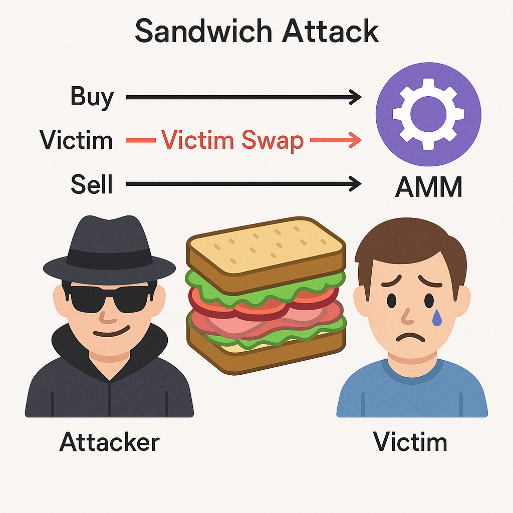

# Panorama (Overview)

Un ataque sandwich es una técnica en la que, cuando un usuario intenta intercambiar tokens en un AMM (Automated Market Maker), el atacante observa la transacción pendiente e inserta sus propias operaciones justo antes y después para extraer beneficio. En concreto, compra con un frontrun antes de que la transacción de la víctima se incluya on‑chain; la víctima ejecuta el swap a un peor precio; y el atacante vende con un backrun para capturar el spread. Como la transacción de la víctima queda “entre” las dos del atacante, se denomina “sandwich”.

## Impacto de los ataques sandwich
Análisis previos reportan cientos de miles de ataques sandwich solo en Ethereum, con beneficios agregados de decenas de millones de dólares para los atacantes. Recientemente, ha habido swaps únicos en Uniswap v3 con pérdidas superiores a 200.000 USD. Ataques similares se repiten en otras redes como BNB Chain; en algunos días, el volumen afectado alcanza miles de millones. Los daños van desde gas desperdiciado por minoristas hasta salidas de capital en grandes operaciones, minando la confianza en DeFi.

## Por qué importa
Los ataques sandwich imponen costes inesperados y degradan la experiencia DeFi. Las víctimas terminan intercambiando a un precio desfavorable por la slippage, o en algunos casos la transacción revierte y pierden la comisión de gas. Si estos ataques son frecuentes, los usuarios perciben DeFi como opaco e injusto y tienden a volver a exchanges centralizados (CEX).

El futuro de DeFi contempla no solo criptoactivos, sino también activos del mundo real (RWA) como acciones, inmuebles, bonos públicos y corporativos, y oro, on‑chain. Si el entorno de negociación sigue siendo vulnerable, la tokenización y adopción de RWA no se materializarán. Por ello, detectar y mitigar ataques sandwich es clave para aumentar la confianza en DeFi y construir mercados libres y descentralizados.
