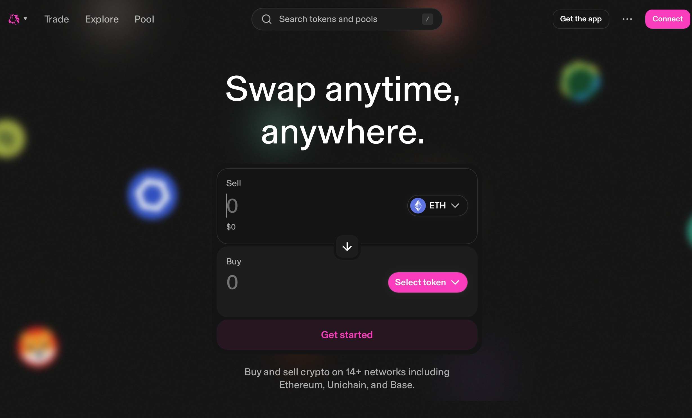

# DeFi alusõpetus
See jaotis selgitab DeFi põhitõdesid, keskendudes Uniswap v2/v3 mehhaanikale. Paljud DeFi protokollid töötavad EVM‑is; Uniswap tõi esmalt AMM‑i, millest kasvasid välja PancakeSwap, SushiSwap jne.



## AMM (Automated Market Maker)
AMM määrab hinna automaatselt likviidsuspuuli põhjal, mitte orderiraamatus. Klassikaline teostus on Uniswap v2, kus hind tuleneb konstantsest korrutisest:

$$
x \times y = k
$$

> Kahe tokeni reservide (x, y) korrutis püsib k‑na. Kui kasutaja vahetab ühte teise vastu, muutuvad reservid ja hind kohandub.

x ja y on reservid, k on konstant. Disain on lihtne ja gaasisäästlik, kuid tundlik suurte vahetuste ja frontrun’ist tingitud hinnamanipulatsiooni suhtes.

Viide: [What is an Automated Market Maker? by Uniswap](https://blog.uniswap.org/what-is-an-automated-market-maker)


## Likviidsuspuul
AMM‑i tehingud toimuvad puuli vahendusel. Kaks tokenit (nt WETH/USDC) deponeeritakse teatud vahekorras ja nende kaudu saab vahetada.

### Kes annab likviidsuse?
- Igaüks saab olla LP.  
- Luba pole vaja; piisab kahe tokeni panusest.  
- Osalus puulis on proportsionaalne panusega.  

### Erinevus CEX‑ist
- CEX  
  - haldab ostu/müügi orderiraamatut ja matšib ordereid  
- AMM  
  - kauple otse puuliga – vastaspoolt pole vaja otsida  
  - hind muutub reservide järgi  
  - orderiraamatut pole; “raamatu õhukuse” tõttu täitmata jäämist esineb harvem  

### Stiimulid
- LP saab osa puulis teenitud tasudest.  
  - Uniswap v2 tasu on tavaliselt 0,3%.  
  - Näide: 10% osalusega LP saab 10% kogutasust.  
- Nii tasustatakse likviidsuse pakkumist.

### Märkused
- IL (impermanent loss) risk tuleneb suhetest puulis.  
- Tasu aitab seda kompenseerida; osalemine on risk/tulu otsus.  


## Uniswap v2 näide

### 1. Algseis

Oletame:
- x = 100 WETH
- y = 300,000 USDC
- The constant product is
$$
k = x \times y = 100 \times 300{,}000 = 30{,}000{,}000
$$

Hind:

$$
\text{Price of 1 WETH} = \frac{y}{x} = \frac{300{,}000}{100} = 3{,}000 \, \text{USDC}
$$

----

### 2. Vahetused

#### Juht A: müü 10 WETH, saa USDC

Kasutaja lisab 10 WETH ja võtab välja USDC.
1. 新的 x 储备：
$$
x' = 100 + 10 = 110
$$

2. k on konstant:
$$
x' \times y' = k
110 \times y' = 30{,}000{,}000
y' = \frac{30{,}000{,}000}{110} \approx 272{,}727.27
$$

3. Saadav USDC:
$$
300{,}000 - 272{,}727.27 = 27{,}272.73 \, \text{USDC}
$$

4. Uus hind:
$$
\frac{y'}{x'} = \frac{272{,}727}{110} \approx 2{,}479 \, \text{USDC/WETH}
$$

Seega 3,000 → ~2,479 USDC/WETH (libisemine).

----

#### Juht B: lisa 30,000 USDC ja osta WETH

Kasutaja lisab 30,000 USDC ja ostab WETH‑i.
1. 新的 y 储备：
$$
y' = 300{,}000 + 30{,}000 = 330{,}000
$$

2. 由于 k 不变：
$$
x' \times 330{,}000 = 30{,}000{,}000
x' = \frac{30{,}000{,}000}{330{,}000} \approx 90.91
$$

3. Saadav WETH:
$$
100 - 90.91 = 9.09 \, \text{WETH}
$$

4. Uus hind:
$$
\frac{330{,}000}{90.91} \approx 3{,}628 \, \text{USDC/WETH}
$$

Seega 3,000 → ~3,628 USDC/WETH.

----

### 3. Mõtted
- Mida suurem order, seda suurem hinnaliikumine/libisemine.  
- See tuleneb x×y=k hoidmisest.  
- Suurte tehingute korral jagatakse order osadeks.  


## v3 对 v2 的改进

v2（2020 年 5 月）以简单的常数乘积模型推动了 DeFi 变革，但在所有价格区间“平均铺设”流动性效率较低，遇到大额交易时滑点较大。

v3（2021 年 5 月）引入集中流动性。LP 可将流动性集中在自选价格区间，使更多流动性分布在实际成交区间，从而降低滑点。


### 示例（WETH/USDC）

- v2
  - 200 WETH 与 600,000 USDC 均匀分布在全部价格区间。
  - 以 1 WETH ≈ 3,000 USDC 为例，任何单一价格区间内的有效流动性都较“薄”。
  - 卖出 10 WETH 后，价格从 3,000 → 约 2,739 USDC/WETH（滑点较大）。

- v3
  - 例如将流动性集中在 2,500–3,500 USDC/WETH 区间。
  - 该区间的有效流动性较 v2 深数倍。
  - 卖出同样 10 WETH，仅从 3,000 → 约 2,950 USDC/WETH（滑点较小）。

---

### 要点
- v3 允许 LP 选择价格区间，提高资金利用效率。
- 在实际成交区间集中资产，可在相同流动性下实现更小滑点。
- 若价格脱离所选区间，LP 头寸可能完全变为单一代币、并不再提供流动性。

## 订单簿模型（CEX 与 Hyperliquid）

### 基本原理

在订单簿交易所，交易者提交“价格 + 数量”的订单，由系统撮合成交。
- 买单（Bid）：希望在此价格或更低价买入
- 卖单（Ask）：希望在此价格或更高价卖出

交易所按价格对订单排序，最高买价与最低卖价相交处发生成交。

示例：WETH/USDC 订单簿
```
卖单（Ask）
3,010 USDC - 50 WETH
3,005 USDC - 30 WETH
3,000 USDC - 20 WETH   ← 最优卖价（Best ask）

买单（Bid）
2,995 USDC - 25 WETH   ← 最优买价（Best bid）
2,990 USDC - 40 WETH
2,985 USDC - 60 WETH
```

---
当前市场（点差）在 3,000–2,995 USDC 之间。
- 市价卖出 10 WETH，约在 3,000 USDC/WETH 附近成交。
- 市价卖出 100 WETH，会“向下吃单”（3,000 → 2,990 → 2,985），平均约 2,990 USDC/WETH。

👉 若订单簿足够“深”，大单的滑点也会有限。


### 与 AMM 的差异
- AMM（如 Uniswap v2）
  - 价格由常数乘积曲线决定
  - 交易沿曲线“滑动”（滑点是内生的）
  - 简单，任何人都能提供流动性
- 订单簿（如 CEX、Hyperliquid）
  - 价格由订单簿决定
  - 深度足够时，大单也能稳定成交
  - 深度不足时，波动可能剧烈（闪崩风险）

### 优缺点

优点
- 流动性深时，滑点更小
- 可通过限价单控制价格
- 适合高吞吐系统（CEX 或部分 L2 DEX）

缺点
- 易出现中心化倾向（CEX 管控订单簿）
- 去中心化实现需要更高的基础设施（链下引擎 / L2）
- 有时不如 AMM 透明（可能存在虚假挂单、操纵）


### Hyperliquid 亮点
- 运行在自有高性能链上（非 EVM 兼容）
- 在链上也追求接近 CEX 的速度
- 由于速度与深度优势，三明治等 MEV 风险比 AMM 更低

[Hyperliquid Foundation](https://hyperfoundation.org)
