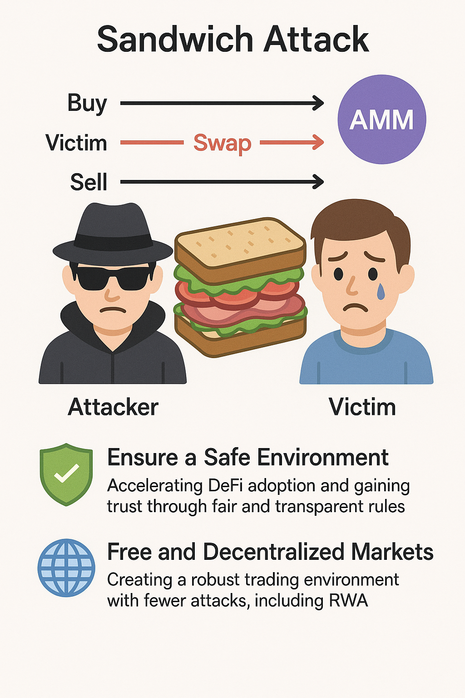

# Kokkuvõte (Conclusion)

Sandwich‑rünnak pole pelgalt tehniline teema – see mõjutab otseselt DeFi usaldusväärsust ja kestlikku kasvu. Kui seda jätta tähelepanuta, kogevad kasutajad jätkuvalt ootamatuid kahjusid ja läbipaistmatuid teostuskulusid ning liiguvad CEX‑idesse tagasi.

Rünnakute vähendamine on tähtis mitte ainult kasutajakaitse seisukohalt, vaid ka kahel põhjusel:

1. Usaldusväärne keskkond
Läbipaistvate ja õiglasete reeglite järgi saavad kõik turvaliselt kaubelda – see kiirendab usalduse ja kasutuse kasvu.

2. Vaba ja detsentraliseeritud turu saavutamine (sh RWA)
Et tuua reaalse maailma varad (RWA) on‑chain, on vaja tervet turukeskkonda minimaalse ründepritsmega.

