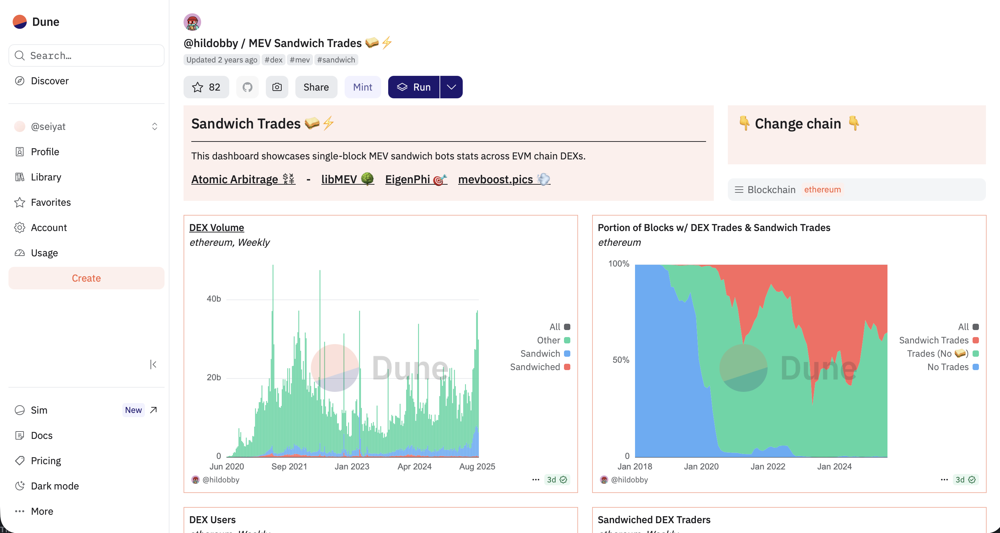
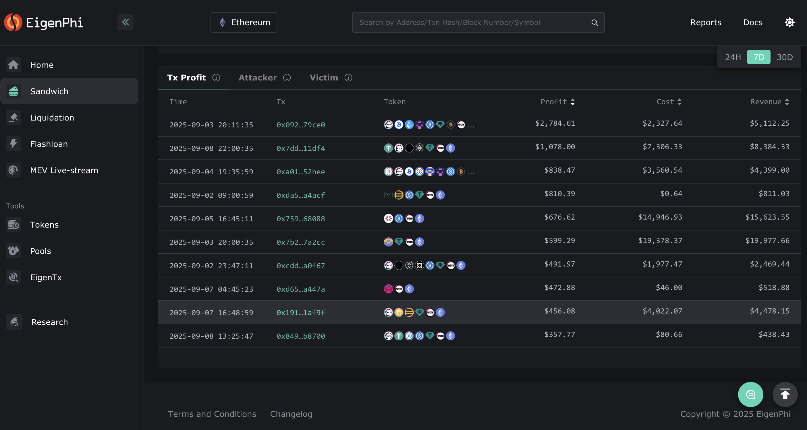

# Visualiseerimistööriistad

Sandwich‑rünnakute visualiseerijad aitavad tuvastada, millistes DeFi tokeni‑vahetustes rünnakuid sagedamini esineb, et vältida kõrge riskiga tehinguid.

## Dune – @hildobby/MEV Sandwich Trades

Näitab graafikute ja tabelitena, millised paarid on enim mõjutatud.

url: https://dune.com/hildobby/sandwiches

## Eigenphi

Kuvab selgelt ründajate kasumi ja ohvrite kahjud.

url: https://eigenphi.io

