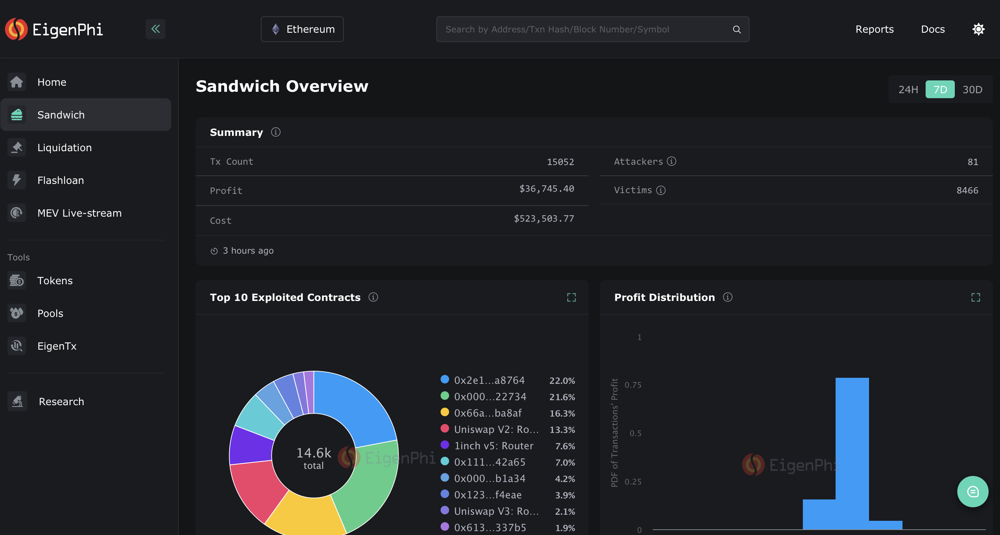

# विज़ुअलाइज़ेशन टूल्स

सैंडविच अटैक के विज़ुअलाइज़ेशन टूल्स यह दिखाने में मदद करते हैं कि किन DeFi टोकन‑स्वैप में हमले अधिक होते हैं, ताकि उपयोगकर्ता जोखिमभरे स्वैप से बच सकें।

## Dune – @hildobby/MEV Sandwich Trades

किस‑किस टोकन‑पेयर पर हमले अधिक होते हैं, इसे ग्राफ़ और टेबल में दिखाता है।

url: https://dune.com/hildobby/sandwiches

## Eigenphi

हमलावर का लाभ और पीड़ित का नुकसान स्पष्ट रूप से दिखाता है।

url: https://eigenphi.io

