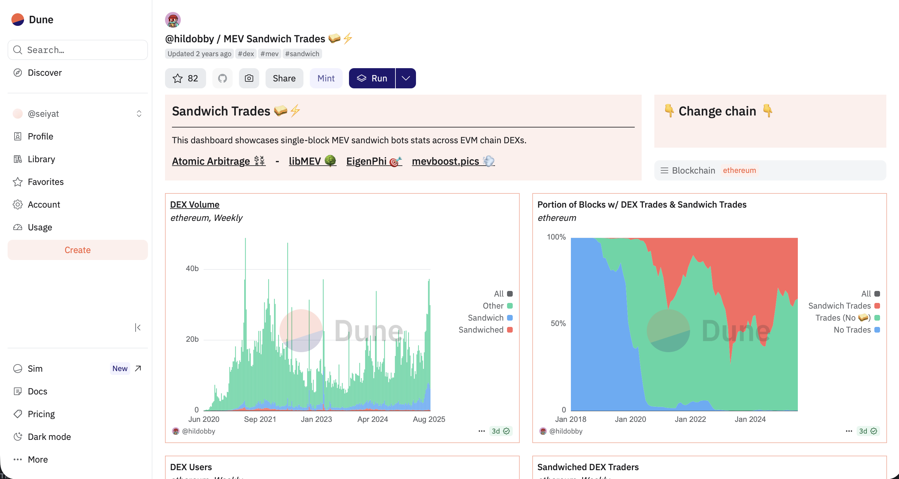

# 可視化ツール

サンドイッチ攻撃の可視化ツールを使うことで、どのDeFiのtoken swapで起きやすいのか見て、危険なswapは避けることができる。

## Dune - @hildobby/MEV Sandwich Trades

どのトークンペアでサンドイッチ攻撃が起きやすいのかグラフやテーブルで見ることができる。

url: https://dune.com/hildobby/sandwiches

## Eigenphi

攻撃者の利益、被害者の損失額などが見やすい

url: https://eigenphi.io

