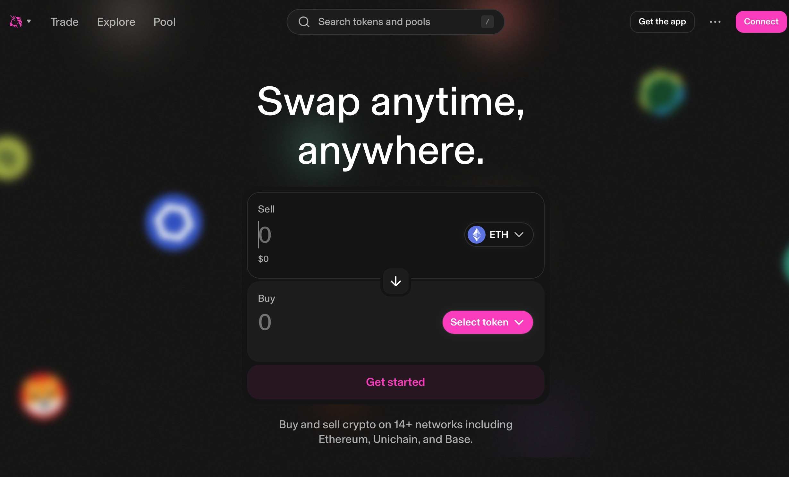

# DeFi 기초
이 문서는 Uniswap v2/v3 로직을 중심으로 DeFi 개요를 설명합니다. DeFi는 EVM 위에 다양하게 존재하며, Uniswap이 최초로 AMM을 고안했고 이후 PancakeSwap, SushiSwap 등으로 포크되었습니다.



## AMM(Automated Market Maker)
AMM은 오더북 없이 유동성 풀에 기반해 자동으로 가격을 정합니다. 대표 구현인 Uniswap v2의 가격은 다음의 정수 곱 모델에 의해 결정됩니다.

$$
x \times y = k
$$

> 풀 내 두 토큰(x, y)의 곱이 항상 일정(k)하도록 유지되는 모델입니다. 한쪽을 스왑하면 다른 쪽 잔고가 변하며 가격이 자동 조정됩니다.

x, y는 각 토큰 잔고, k는 상수입니다. 단순하고 가스 효율이 좋지만, 대규모 스왑·프런트런 가격 조작에는 취약합니다.

ref: [What is an Automated Market Maker? by Uniswap](https://blog.uniswap.org/what-is-an-automated-market-maker)


## 유동성 풀
유동성 풀은 AMM 거래의 기반입니다. 두 토큰(예: WETH/USDC)을 일정 비율로 예치하면 풀을 만들 수 있고, 사용자는 풀과 직접 스왑합니다.

### 누가 유동성을 제공하나
- 누구나 LP(Liquidity Provider)가 될 수 있습니다.  
- 별도 심사 없이 두 토큰을 비율대로 예치하면 참여 가능.  
- 기여 비율에 따라 풀 지분이 결정됩니다.

### CEX와의 차이
- CEX(중앙화 거래소)
  - 오더북에 매수/매도 주문이 쌓이고 매칭됨.  
- AMM(탈중앙 거래소)
  - 상대를 찾지 않고 풀과 직접 스왑.  
  - 잔고 변화로 가격이 자동 결정.  
  - 오더북 부재로 “책이 얕아 체결 실패” 상황이 비교적 드뭄.

### 보상(인센티브)
- LP는 풀 사용으로 발생한 거래 수수료를 지분만큼 배분받습니다(예: Uniswap v2는 통상 0.3%).
- 예: 풀 지분 10%면 수수료 수익의 10%를 취득.
- 즉, LP는 유동성을 공급하고 보상을 받는 주체가 됩니다.

### 포인트
- 누구나 LP가 될 수 있으나, 비율 변동으로 인퍼머넌트 로스(IL) 위험 존재.  
- 수수료 수익과의 균형 속에서 참여 여부를 결정.


## Uniswap v2 스왑 예시

### 1) 초기 풀 상태

다음과 같은 풀을 가정합니다.
- x = 100 WETH
- y = 300,000 USDC
 - 따라서 정수 곱 k는
$$
k = x \times y = 100 \times 300{,}000 = 30{,}000{,}000
$$

이때 1 WETH의 가격은

$$
\text{Price of 1 WETH} = \frac{y}{x} = \frac{300{,}000}{100} = 3{,}000 \, \text{USDC}
$$

----

### 2) 사용자 스왑

#### A: 10 WETH를 팔고 USDC 받기

사용자가 풀에 10 WETH를 넣고 USDC를 인출합니다.
1) 새로운 x 잔고:
$$
x' = 100 + 10 = 110
$$

2) k는 일정하므로:
$$
x' \times y' = k
110 \times y' = 30{,}000{,}000
y' = \frac{30{,}000{,}000}{110} \approx 272{,}727.27
$$

3) 사용자가 받는 USDC:
$$
300{,}000 - 272{,}727.27 = 27{,}272.73 \, \text{USDC}
$$

4) 새로운 가격:
$$
\frac{y'}{x'} = \frac{272{,}727}{110} \approx 2{,}479 \, \text{USDC/WETH}
$$

즉, 거래 후 가격은 3,000 → 약 2,479 USDC/WETH로 하락(슬리피지).

----

#### B: 30,000 USDC를 넣고 WETH 사기

반대로 30,000 USDC를 넣어 WETH를 삽니다.
1) 새로운 y 잔고:
$$
y' = 300{,}000 + 30{,}000 = 330{,}000
$$

2) k는 일정하므로:
$$
x' \times 330{,}000 = 30{,}000{,}000
x' = \frac{30{,}000{,}000}{330{,}000} \approx 90.91
$$

3) 사용자가 받는 WETH:
$$
100 - 90.91 = 9.09 \, \text{WETH}
$$

4) 새로운 가격:
$$
\frac{330{,}000}{90.91} \approx 3{,}628 \, \text{USDC/WETH}
$$

즉, 거래 후 가격은 3,000 → 약 3,628 USDC/WETH로 상승.

----

### 3) 요약
- 주문이 클수록 가격이 크게 움직여 불리한 가격(슬리피지)이 증가합니다.
- 이는 x×y=k 유지의 부작용입니다.
- 큰 트레이더는 슬리피지를 줄이려 주문을 나누기도 합니다.


## Uniswap v3: v2의 한계 개선

v2(2020.05)는 단순 모델로 혁신을 이뤘지만, 전 가격대 균등 배치는 비효율적이어서 대형 스왑에 슬리피지가 컸습니다.

v3(2021.05)는 집중 유동성을 도입해 LP가 원하는 가격대에 유동성을 모을 수 있게 했습니다. 실제 체결대역에 유동성이 모여 슬리피지가 줄어듭니다.


### 예시(WETH/USDC)

- v2
  - 200 WETH/600,000 USDC가 균등 배치. 특정 구간에서는 유동성이 얕음.
  - 10 WETH 매도 시 3,000 → 약 2,739 USDC/WETH로 하락(큰 슬리피지).

- v3
  - 예: 2,500–3,500 USDC/WETH 구간에 집중 배치.
  - 해당 구간의 실효 유동성은 v2 대비 수배로 깊음.
  - 같은 10 WETH 매도 시 3,000 → 약 2,950 USDC/WETH(작은 슬리피지).

---

### 포인트
- v3는 LP가 가격대를 선택해 자본 효율을 높입니다.
- 실제 체결대역에 자산이 집중되어 동일 유동성 대비 슬리피지가 적습니다.
- 가격이 구간을 벗어나면 포지션이 한쪽 토큰으로 변해 유동성이 0이 될 수 있습니다.

## 오더북 방식(CEX/Hyperliquid)

### 기본 구조

오더북 거래는 가격·수량을 지정해 주문을 제출하고, 이를 매칭하여 체결합니다.
- Bid: 이 가격 이하로는 사고 싶다
- Ask: 이 가격 이상으로는 팔고 싶다

거래소는 가격순으로 정렬하고, 최고 구매가와 최저 판매가가 만나는 지점에서 체결합니다.

예: WETH/USDC 오더북
```
호가(Ask)
3,010 USDC - 50 WETH
3,005 USDC - 30 WETH
3,000 USDC - 20 WETH   ← 최우수 매도(베스트 애스크)

매수(Bid)
2,995 USDC - 25 WETH   ← 최우수 매수(베스트 비드)
2,990 USDC - 40 WETH
2,985 USDC - 60 WETH
```

---
현재 시장(스프레드)은 3,000–2,995 USDC입니다.
- 10 WETH 시장가 매도 → ~3,000 USDC/WETH 체결
- 100 WETH 시장가 매도 → 3,000 → 2,990 → 2,985로 ‘걷어 내려가며’ 평균 ~2,990 USDC/WETH

👉 유동성이 깊으면 대형 주문도 슬리피지가 제한적입니다.


### AMM과의 차이
- AMM(예: Uniswap v2)
  - 정수 곱 곡선으로 가격 자동 결정
  - 곡선을 따라 반드시 미끄러짐(슬리피지 불가피)
  - 단순하고 누구나 유동성 공급 가능
- 오더북(예: CEX, Hyperliquid)
  - 오더북 기반 가격 결정
  - 오더북이 깊으면 대형 주문도 안정적 체결
  - 얕으면 급변 가능(플래시 크래시 위험)

### 장단점

장점
- 유동성이 깊으면 슬리피지가 적음
- 지정가 주문으로 가격 통제 가능
- 고성능 체결에 유리(CEX·일부 L2 DEX)

단점
- 중앙화 우려(CEX가 오더북을 관리)
- 완전 탈중앙 구현엔 높은 인프라 요구(오프체인 엔진/L2)
- 일부 경우 AMM보다 투명성이 낮을 수 있음(스푸핑 등)


### Hyperliquid 특징
- EVM 호환이 아닌 독자 고성능 체인 채택
- 온체인 처리에서도 CEX급 속도를 지향하는 드문 오더북 DEX
- 빠르고 오더북이 깊어 샌드위치 같은 MEV 위험이 AMM보다 낮음

[Hyperliquid Foundation](https://hyperfoundation.org)
