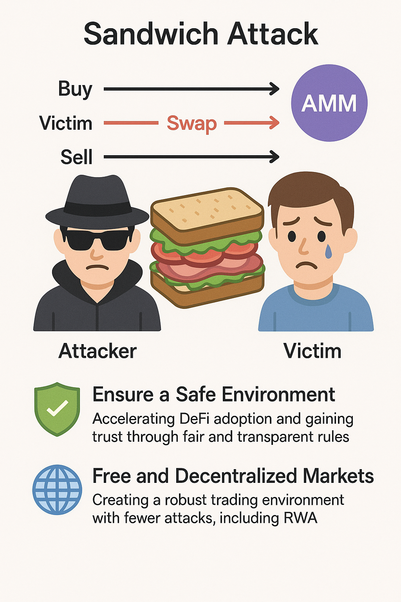

# 결론 (Conclusion)

샌드위치 공격은 단순한 기술 문제가 아니라, DeFi의 신뢰성과 지속 성장에 직결된 과제입니다. 이를 방치하면 사용자는 “예상치 못한 손실”과 “불투명한 실행 비용”을 겪으며, DeFi를 떠나 CEX로 회귀하게 됩니다.

따라서 우리는 샌드위치 공격을 줄이기 위한 노력을 진행해야 합니다. 이는 사용자 보호 차원을 넘어, 다음 두 가지 이유에서 매우 중요합니다.

1. 안심하고 이용할 수 있는 환경 조성
투명하고 공정한 규칙 아래 누구나 거래할 수 있어야 DeFi의 신뢰와 채택이 가속됩니다.

2. RWA를 포함한 자유롭고 분산된 시장 실현
주식·부동산·금·채권 등 실물자산(RWA)을 온체인에서 다루려면, 공격이 적은 건전한 거래 환경이 필수입니다.

