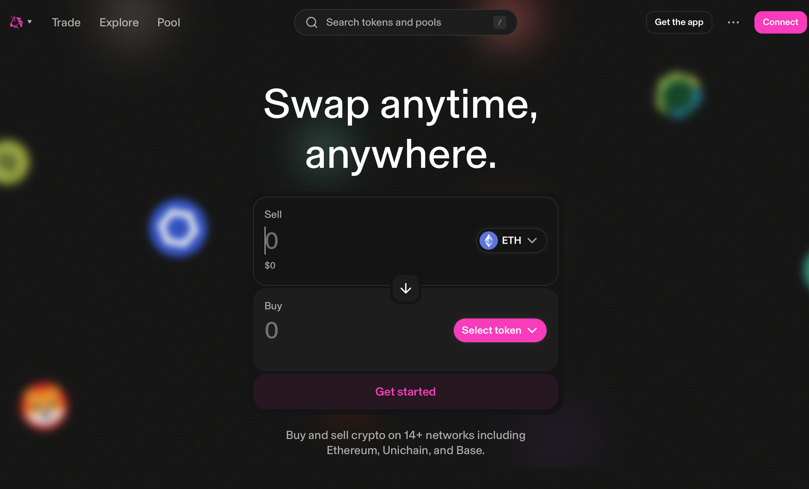

# DeFiの基礎
Uniswap v2やv3のロジックなどを中心にDeFiの概要を説明します。DeFiはEVM上にたくさん存在しますが、Uniswapが最初にAMMを発案しました。その後UniswapがforkされPancakeswapやSushiswapなどが作成されました。



## AMM（Automated Market Maker）
AMMはオーダーブックを持たず、流動性プール に基づいて自動的に価格を決定する仕組みである。代表的な実装は Uniswap v2 であり、価格は以下の 定数積モデル によって決まる。

$$
x \times y = k
$$

> この式は、プール内の2種類のトークン（x, y）の積が常に一定（k）となる「定数積モデル（Constant Product Model）」を表しています。ユーザーが一方のトークンをスワップすると、もう一方のトークン残高が変化し、価格が自動的に調整されます。

ここで x, y はそれぞれのトークン残高、k は一定値である。
シンプルかつガス効率が良い一方、大規模スワップやフロントランによる価格操作に弱い。

ref: [What is an Automated Market Maker? by Uniswap](https://blog.uniswap.org/what-is-an-automated-market-maker)


## 流動性プール
流動性プール（Liquidity Pool）は、AMM における取引の基盤となる仕組みである。  
2種類のトークン（例: WETH/USDC）を一定の比率で預け入れることでプールが構築され、ユーザー同士のスワップ取引が可能になる。

### 誰が流動性を提供するのか？
- **誰でも流動性提供者（LP: Liquidity Provider）になれる**。  
- 特別な審査はなく、ウォレットから対応する2種類のトークンを一定比率でデポジットするだけで参加可能。  
- 提供した比率に応じて、プール全体に占める自分のシェア（割合）が決まる。

### 仕組み（CEXとの違い）
- **CEX（中央集権型取引所）**  
  - オーダーブック形式で「買い注文」「売り注文」が並ぶ。  
  - 板に並んだ注文同士をマッチングさせて取引を成立させる。  
- **AMM（分散型取引所, DEX）**  
  - ユーザーが相手を探さなくても、プールに直接スワップをぶつける。  
  - プールの残高変動により価格が自動的に決まる。  
  - オーダーブックが存在しないため、CEXのように「板が薄いから約定できない」という状況は発生しにくい。

### 報酬（インセンティブ）
- 流動性提供者（LP）は、プールを利用して発生する**取引手数料**をシェアに応じて受け取る。  
  - Uniswap v2 では通常 0.3% の手数料。  
  - 例: プール全体に 10% のシェアを持つ LP は、発生した手数料収益の 10% を獲得する。  
- これにより、LP は「取引所に流動性を供給する代わりに報酬を得る」立場となる。

### ポイント
- 誰でも LP になれるが、プール残高比率が変動することで「インパーマネントロス（IL）」と呼ばれるリスクを負う。  
- 一方で、取引手数料の収益が得られるため、リスクとリターンのバランスで参入が決まる。


## Uniswap V2のswapの具体例

### 1. プールの初期状態

例えば以下のようなプールを考えます。
- x = 100 WETH
- y = 300,000 USDC
- よって定数積は
$$
k = x \times y = 100 \times 300{,}000 = 30{,}000{,}000
$$

このときの 価格は

$$
\text{1 WETH の価格} = \frac{y}{x} = \frac{300{,}000}{100} = 3{,}000 \, \text{USDC}
$$

----

### 2. ユーザーがスワップするケース

#### ケースA: 10 WETH を売って USDC を買う

ユーザーがプールに 10 WETH を追加し、代わりに USDC を引き出す。
1.	新しい x の残高は
$$
x' = 100 + 10 = 110
$$

2.	k は一定なので、
$$
x' \times y' = k
110 \times y' = 30{,}000{,}000
y' = \frac{30{,}000{,}000}{110} \approx 272{,}727.27
$$

3.	ユーザーが受け取る USDC は
$$
300{,}000 - 272{,}727.27 = 27{,}272.73 \, \text{USDC}
$$

4.	新しい価格は
$$
\frac{y'}{x'} = \frac{272{,}727}{110} \approx 2{,}479 \, \text{USDC/WETH}
$$

つまり、取引後は価格が 3,000 → 約2,479 USDC/WETH に下がる（スリッページ）。

----

#### ケースB：30,000 USDC を入れて WETH を買う

逆に、ユーザーが 30,000 USDC をプールに入れて WETH を買う。
1.	新しい y の残高は
$$
y' = 300{,}000 + 30{,}000 = 330{,}000
$$

2.	k 一定なので
$$
x' \times 330{,}000 = 30{,}000{,}000
x' = \frac{30{,}000{,}000}{330{,}000} \approx 90.91
$$

3.	ユーザーが受け取る WETH は
$$
100 - 90.91 = 9.09 \, \text{WETH}
$$

4.	新しい価格は
$$
\frac{330{,}000}{90.91} \approx 3{,}628 \, \text{USDC/WETH}
$$

つまり、取引後は価格が 3,000 → 約3,628 USDC/WETH に上がる。

----

### 3. ポイント
- プールに大きく注文を入れるほど、価格が動いて「不利な価格（スリッページ）」になる。
- これは常に x×y=k を保つ仕組みの副作用。
- 大口トレーダーはスリッページを避けるために複数回に分けてスワップすることもある。


## Uniswap v2 の欠点を改善した Uniswap v3

Uniswap v2 は 2020年5月 にリリースされ、シンプルな定数積モデルによって DeFi に革命をもたらした。しかし、すべての価格帯に均等に流動性を配置する設計には非効率性があり、特に大規模スワップ時にスリッページが大きくなる問題があった。

Uniswap v3 は 2021年5月 に登場し、**集中流動性（Concentrated Liquidity）** の概念を導入した。流動性提供者（LP）は、資産を任意の価格帯に集中して配置できるようになり、実際の取引が発生するレンジに多くの流動性が集まることでスリッページが小さくなる。


### 具体例（WETH/USDC）

- **v2 の場合**
  - プールに 200 WETH と 600,000 USDC が均等に配置されている。
  - 1 WETH = 3,000 USDC を基準に、あらゆる価格帯に流動性が広がっているため、特定の価格レンジに対して「薄い」。
  - ユーザーが 10 WETH を売却すると、価格は 3,000 → 約 2,739 USDC/WETH まで下落する（大きなスリッページ）。

- **v3 の場合**
  - LP が 2,500〜3,500 USDC/WETH のレンジに流動性を集中して配置する。
  - この価格帯に限れば、実効的な流動性は v2 よりも数倍「厚く」なる。
  - 同じ 10 WETH を売却しても、価格は 3,000 → 約 2,950 USDC/WETH にしか下がらず、スリッページは小さい。

---

### ポイント
- v3 では、LP が「価格帯を選択して流動性を提供」できるため、効率的な資本利用が可能。
- 実際に取引されるレンジに資産が集中するので、**同じ流動性量でもスリッページが少なくなる**。
- 一方で、価格が指定レンジを外れると LP の資産が片側トークンに変換され、流動性がゼロになるリスクがある。

## オーダーブック形式（CEXやHyperliquid）

### 基本の仕組み

オーダーブック（板取引）形式では、トレーダーが「価格」と「数量」を指定して注文を出し、それをマッチングさせることで取引が成立する。
- 買い注文（Bid）: この価格以下なら買いたい
- 売り注文（Ask）: この価格以上なら売りたい

取引所はこれらを価格順に並べ、「最も高い買い注文」と「最も安い売り注文」が交わる点で取引が成立する。

例：WETH/USDC のオーダーブック
```
売り板 (Ask)
3,010 USDC - 50 WETH
3,005 USDC - 30 WETH
3,000 USDC - 20 WETH   ← 最良売り

買い板 (Bid)
2,995 USDC - 25 WETH   ← 最良買い
2,990 USDC - 40 WETH
2,985 USDC - 60 WETH
```

---
現在の市場価格（スプレッド）は 3,000〜2,995 USDC の範囲
- ユーザーが 10 WETH を成行売りすると、3,000 USDC で20 WETHの買い注文の一部とマッチングし、平均価格はほぼ 3,000 USDC/WETH になる
- 仮に 100 WETH を成行売りすると、3,000 → 2,990 → 2,985 と複数の注文を食い潰す形で約定し、平均価格は 約 2,990 USDC/WETH になる

👉 大口注文時も、深い流動性がある限りスリッページは限定的


### AMMとの違い
- AMM (例: Uniswap v2)
- 定数積モデルで価格が自動決定
- 価格曲線に沿って必ず滑る（スリッページ不可避）
- シンプルで誰でも流動性提供できる
- オーダーブック (例: CEX, Hyperliquid)
- 注文の板に基づいて価格決定
- 板が厚ければ大口注文でも価格は安定
- 板が薄いと大きく動く（Flash Crashのリスク）

### メリットとデメリット

メリット
- スリッページが少ない（流動性が厚い場合）
- トレーダーが価格をコントロールできる（指値注文）
- 高速処理に適している（特にCEXやL2系DEX）

デメリット
- 中央集権化しやすい（CEXの場合は取引所が板を管理）
- インフラ要件が高い（分散型で実装する場合は高性能なオフチェーン/Layer2技術が必要）
- 透明性がAMMより劣る場合がある（板操作や見せ板など）


### Hyperliquid の特徴
- Ethereum互換ではなく、独自の高性能チェーンを採用
- オーダーブックDEXとしては珍しく、オンチェーン処理でもCEX並みの速度を目指している
- 高速かつ板が厚いため、サンドイッチ攻撃のようなMEVリスクはAMMより低い

[Hyperliquid Foundation](https://hyperfoundation.org)
